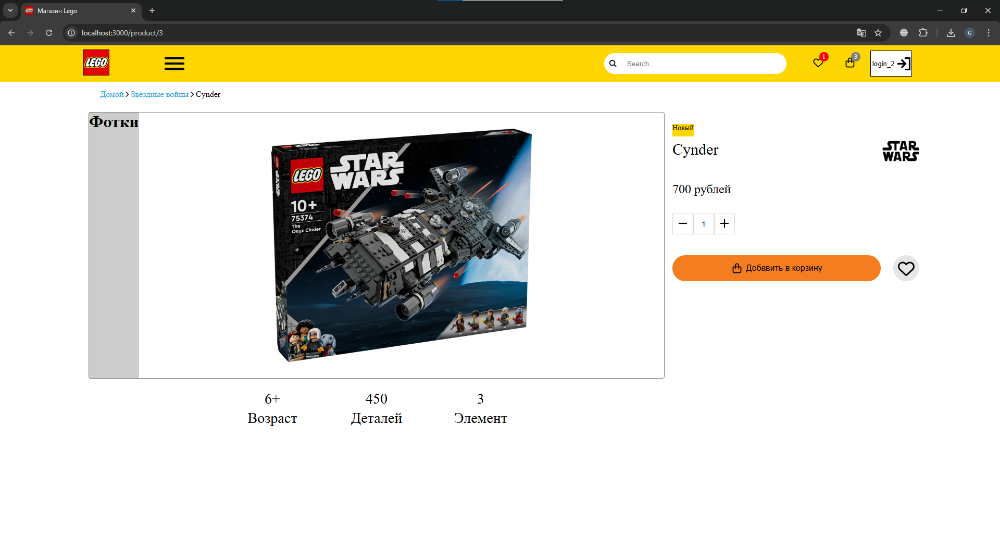

# Проект "Лего"

### В данном репозитории представлен Pet-проект "Лего". 
### В качестве дизайна был выбран официальный сайт Лего

Цель проекта: изучить React-фреймворк

Технологии: HTML, CSS, React, json-server

Реализовано:
1) Регистрация и аутентификация для пользователя
2) Для каждого аккаунта своя корзина и раздел избранного
3) Поиск товаров по имени и категории
4) Добавление и удаление товаров в избранное и корзину только для авторизованных пользователей
5) Отдельные страницы для каждого товара, страница избранного и страница корзины
6) Подсчёт общей суммы всех товаров и количества в корзине
7) Кнопка оплатить и процесс оплаты
7) Пагинация товаров





Пример кода запроса на сервер товаров в избранном
```JavaScript
    const loadFavorites = async () => {
        try {
            const response = await fetch(`http://localhost:5000/favorites`)
            const result = await response.json()
            setFavoriteProducts(result)
        } catch (error) {
            console.log(error)
        }
    }
```

Пример кода запроса на добавление/удаление товара в корзину
```JavaScript
const addToBasket = async (product) => {
        if (!user) {
            openModal();
            return;
        }
        
        try {
            const isAlreadyInBasket = basketProducts.find((item) => item.productId === product.id && item.userId === user.id);

            if(isAlreadyInBasket) {
                await fetch(`http://localhost:5000/basket/${isAlreadyInBasket.id}`, {
                method: "DELETE"
            })
            } else {
                await fetch(`http://localhost:5000/basket`, {
                    method: 'POST',
                    body: JSON.stringify({
                        userId: user.id,
                        productId: product.id,
                        quantity: 1
                    }),
                    headers: {
                    'Content-Type': 'application/json',
                },
            })
            }
            await loadBasket();
        } catch (error) {
            console.error('Ошибка при работе с корзиной:', error);
        }
    }
```


В настоящий момент проект дорабатывается. Задача сделать максимально приближенный к оригиналу проект.

Исправить(доработать):
1) Пофиксить неточности в пагинации и счётчиках
2) Проработать дизайн уже в сделанных разделах