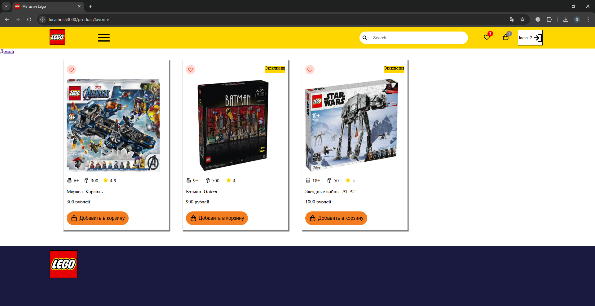
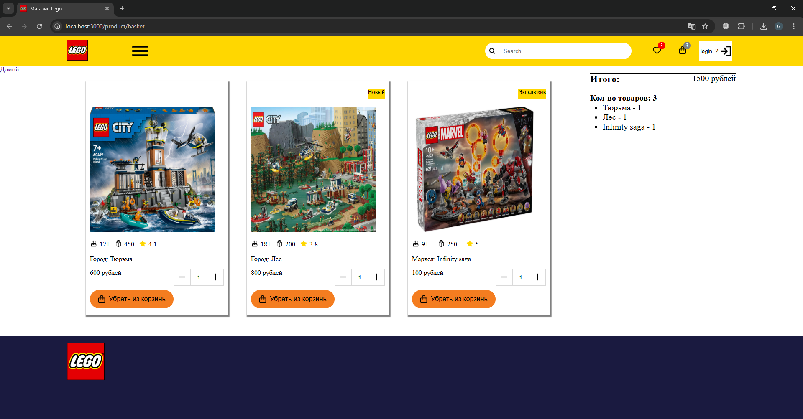

# Проект "Лего"

### В данном репозитории представлен Pet-проект "Лего". 
### В качестве дизайна был выбран официальный сайт Лего

Цель проекта: изучить React-фреймворк

Технологии: HTML, CSS, React, json-server

Реализовано:
1) Регистрация и аутентификация для пользователя
2) Поиск товаров по имени и категории
3) Добавление и удаление товаров в избранное и корзину только для авторизованных пользователей
4) Отдельные страницы для каждого товара, страница избранного и страница корзины
5) Подсчёт общей суммы всех товаров и количества в корзине
6) Пагинация товаров







Пример кода запроса на сервер товаров в избранном
```JavaScript
    const loadFavorites = async () => {
        try {
            const response = await fetch(`http://localhost:5000/favorites`)
            const result = await response.json()
            setFavoriteProducts(result)
        } catch (error) {
            console.log(error)
        }
    }
```


В настоящий момент проект дорабатывается. Задача сделать максимально приближенный к оригиналу проект.

Исправить(доработать):
1) Проработать дизайн уже в сделанных разделах
2) Добавить разные сортировки